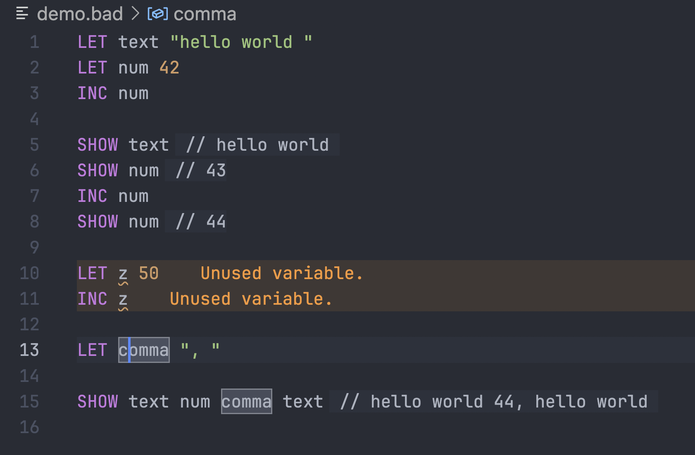

# badlang

Toy language for a talk about LSP.

## Language features

Barely any. You can:

- define int/string variables (`LET`)
- increment int variables (`INC`)
- print a concatenation of any number of variables (`SHOW`).

## Editor features

- Syntax highlighting
- Diagnostics (parse errors, type errors, linting)
- Go to definition / find references
- Rename variable
- Inlay hints (used to display output of `SHOW`)
- Document symbol provider (go to symbol, breadcrumbs, document outline)

## Example

